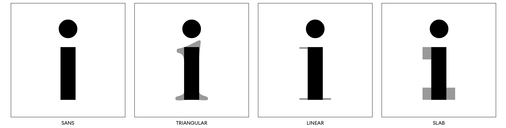

# Official repository (Serif Classification) for Toward Automatic Typography Analysis: Serif Classification and Font Similarities

[Syed Talal Wasim](https://talalwasim.github.io),
[Romain Collaud](https://people.epfl.ch/romain.collaud),
[Lara Défayes](https://people.epfl.ch/lara.defayes/?lang=en),
[Nicolas Henchoz](https://people.epfl.ch/nicolas.henchoz?lang=en),
[Mathieu Salzmann](https://people.epfl.ch/mathieu.salzmann),
[Delphine Ribes](https://people.epfl.ch/delphine.ribes)

> **Abstract:**
>*Whether a document is of historical or contemporary significance, typography plays a crucial role in its composition. From the earliest forms of writing in Mesopotamia to the early days of modern printing, typographic techniques have evolved and transformed, resulting in changes to the features of typography. By analyzing these features, we can gain insights into specific time periods, geographical locations, and messages conveyed through typography. Therefore, in this paper, we aim to investigate the feasibility of training a model to classify serif types without knowledge of the font and character. We also investigate how to train a vectorial-based image model able to group together fonts with similar features.
Specifically, we compare the use of state-of-the-art image classification methods, such as the EfficientNet-B2 and the Vision Transformer Base model with different patch sizes, and the state-of-the-art fine-grained image classification method, TransFG, on the serif classification task.
We also evaluate the use of the DeepSVG model to learn to group fonts with similar features.
Our investigation reveals that fine-grained image classification methods are better suited for the serif classification tasks and that leveraging the character labels helps to learn more meaningful font similarities.*

  

## Usage
### Environment Setup
Refer to `requirements.txt` for installing all python dependencies. We use python 3.8.13 with pytorch 1.14.0.

### Repository Structure
The default `train.py` file trains general image classification models (ResNets, EfficientNets and ViTs). For finegrained image classification , please refer to the directory `Finegrained`, which is based on the [TransFG](https://github.com/TACJu/TransFG) model.

### Dataset Preparation

*Dataset will be released soon*

### Train

To train TransFG on Serifs dataset, please refer to the `scripts` folder and update the `--train_folder` and `--test_folder` arguments.

## Acknowledgements
Our fine-grained recognition code is based on [TransFG](https://github.com/TACJu/TransFG) repository. We thank the authors for releasing their code. If you use our model, please consider citing their work as well.